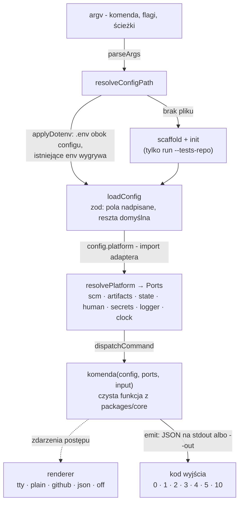
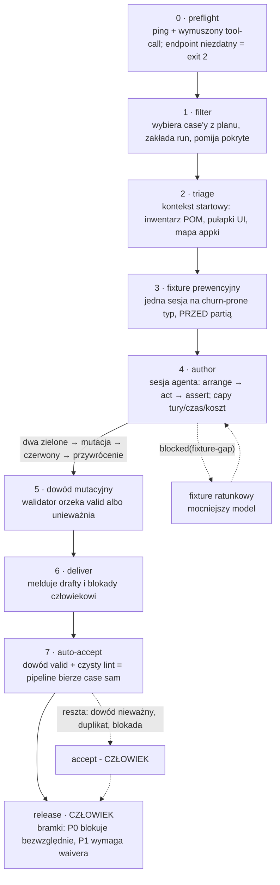
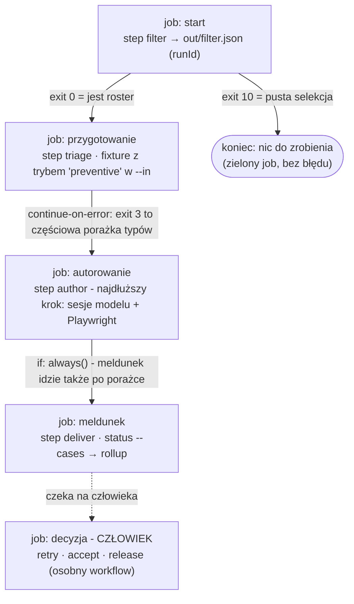
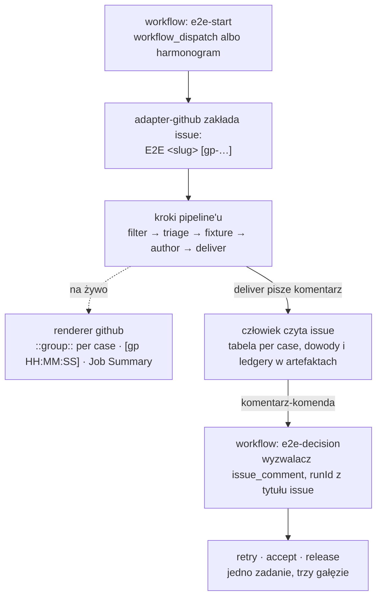
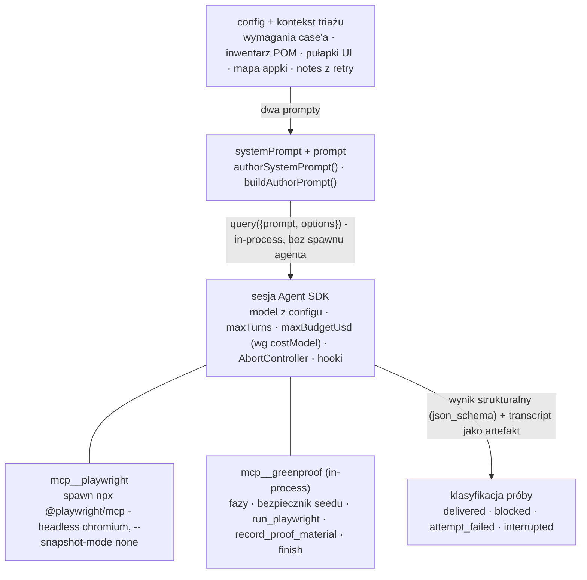

# Anatomia greenproof

Jak biblioteka jest zbudowana i jak wchodzi w trzy różne procesy: terminal
człowieka, dowolne CI i GitHub Actions. Te same kroki, trzy sposoby podania.

Wersja graficzna (lokalna, poza gitem):
[docs/schematy/anatomia.html](docs/schematy/anatomia.html) - otwórz w przeglądarce.

---

## Fundament: rdzeń nie wie, gdzie działa

Cała logika żyje w `packages/core` i nie importuje niczego platformowego.
Nie wie, czy zapisuje pliki na dysku, czy woła REST API GitHuba - rozmawia
wyłącznie przez **porty**. Adapter dostarcza implementacje, CLI je składa
i podaje krokowi pipeline'u.

To jedna decyzja projektowa, z której wynika wszystko poniżej: skoro krok
dostaje porty z zewnątrz, ten sam krok da się odpalić w terminalu, w jobie CI
i w Actions bez żadnej gałęzi `if (ci)` w kodzie.

| Port | Rola |
|---|---|
| `ScmPort` | repo testów: branche, commity, diff; jedyny push robi `accept` |
| `ArtifactStore` | ledgery prób, dowody mutacyjne, transcripty sesji, konteksty triażu |
| `StateStore` | stan przebiegu z optimistic lockingiem - CAS broni przed równoległym zapisem |
| `HumanChannelPort` | kanał do człowieka: na dysku plik, na GitHubie issue przebiegu |
| `SecretsPort` · `Logger` · `Clock` | trzy drobne kontrakty, dzięki którym rdzeń jest testowalny bez świata |

Implementacje kompletu: `adapter-fs` i `adapter-github`; trzecia, firmowa,
to nowy pakiet - nie fork rdzenia. Adapter wybiera pole `platform` w configu,
więc zmiana „dysk → GitHub" to jedna linijka, nie przepisywanie pipeline'u.

---

## Schemat 1 · CLI: od argv do kodu wyjścia

CLI jest celowo cienkie: parsuje argumenty, znajduje i waliduje config,
buduje porty i woła czystą funkcję komendy. Nic z logiki pipeline'u tu nie
mieszka - `main.ts` tylko serializuje wynik i tłumaczy wyjątki na kody wyjścia.



Wejście każdej komendy to jeden obiekt JSON walidowany schematem zod,
wyjście - też JSON. Ta symetria sprawia, że kroki dają się łańcuchować w CI
bez klejenia tekstu.

**Renderer postępu wybiera się sam.** Tryb `auto` patrzy na środowisko:
`GITHUB_ACTIONS` włącza renderer `github`, żywy terminal - tablicę `tty`
odświeżaną w miejscu, wszystko inne dostaje linie `plain`. Wymuszenie:
`GREENPROOF_PROGRESS`.

| Kod | Znaczenie | Co z nim zrobić |
|---|---|---|
| `0` | OK | czytaj wynik |
| `1` | infrastruktura albo błąd nieznany | ponów krok |
| `2` | walidacja wejścia lub configu; preflight odrzucił endpoint | popraw wejście - **nie ponawiaj na ślepo** |
| `3` | co najmniej jeden case `blocked`/`attempt_failed`/`failed` | normalna sytuacja: decyduj per case; w skrypcie toleruj |
| `4` | `StateConflictError` - CAS obronił stan | ponów tę samą komendę |
| `5` | bramki jakości nie przeszły | tylko `release`: czytaj `gates`, waiver albo domknij case'y |
| `10` | filtr nie wybrał żadnego case'a | plan pusty albo wszystko już pokryte |

Kody wyjścia to interfejs sterujący dla CI - dlatego `3` i `5` są „miękkie":
znaczą wynik do oceny, nie awarię.

---

## Schemat 2 · Pipeline: siedem kroków i jedna bramka

Pipeline jest tą samą sekwencją niezależnie od sposobu uruchomienia.



Auto-akceptacja nie jest uznaniowa: to deterministyczny werdykt dowodu,
nie ocena agenta. Zielony test bez ważnego dowodu jest bezwartościowy.

### Stany case'a

Maszyna stanów (`CASE_TRANSITIONS` w `packages/core/src/domain/state.ts`)
jest jedynym źródłem prawdy o tym, co wolno zrobić dalej - próba nielegalnego
przejścia rzuca `InvalidTransitionError`, zamiast po cichu zepsuć stan.

| Stan | Dokąd może przejść | Co to znaczy |
|---|---|---|
| `pending` | `selected`, `skipped` | case z planu, jeszcze nieoceniony przez filtr |
| `selected` | `triaged` | wybrany do przebiegu |
| `triaged` | `authoring` | kontekst startowy gotowy |
| `authoring` | `proving`, `blocked`, `attempt_failed` | sesja agenta trwa |
| `proving` | `delivered`, `attempt_failed` | walidator ocenia dowód mutacyjny |
| `delivered` | `in_review` | draft zameldowany człowiekowi |
| `in_review` | `accepted`, `retry_requested` | czeka na decyzję albo już ją dostał |
| `accepted` | `released` | PR otwarty - to jedyny push |
| `blocked` | `triaged` | cap czasu/tur, brak fixture'a albo defekt appki - retry po usunięciu przyczyny |
| `attempt_failed` | `triaged`, `failed` | próba padła; retry z uwagami człowieka |

---

## Schemat 3 · CI: krok per job, JSON między nimi

W terminalu `gp run` robi wszystko w jednym procesie. W CI dzieli się to na
osobne zadania: każde woła `gp step <krok>`, zapisuje wynik do pliku,
a następne czyta z niego `runId`. Nic poza plikiem JSON i kodem wyjścia nie
przechodzi między krokami - dlatego zadania mogą siedzieć na różnych maszynach.



Podział na zadania nie jest kosmetyczny: `step author` potrafi trwać godzinami
i potrzebuje przeglądarki, a `step filter` to sekundy na czystym Node.
Rozdzielone - dostają różne maszyny, timeouty i polityki ponawiania.

```sh
# Łańcuch kroków: runId wyciągany z wyniku poprzedniego
gp step filter  --config gp.config.mjs --in filter-in.json --out out/filter.json
RUN_ID=$(jq -r .runId out/filter.json)

gp step triage  --config gp.config.mjs --run "$RUN_ID"
gp step author  --config gp.config.mjs --run "$RUN_ID"   # toleruj exit 3
gp step deliver --config gp.config.mjs --run "$RUN_ID"
gp status       --config gp.config.mjs --run "$RUN_ID" --out out/status.json
```

> **Pułapka:** `--in` przyjmuje *ścieżkę do pliku*, nigdy inline JSON
> w argumencie. W skryptach CI buduj wejście przez `jq -n` do pliku -
> najczęstszy błąd przy pierwszym wpięciu.

---

## Schemat 4 · GitHub Actions: issue jako konsola człowieka

Na GitHubie dochodzą dwie rzeczy, których nie ma w gołym CI: adapter zamienia
issue przebiegu w kanał do człowieka, a renderer dopasowuje się do składni
logów Actions. Nie trzeba tego konfigurować - CLI wykrywa
`GITHUB_ACTIONS=true` samo.



Dwa workflow zamiast jednego: `e2e-start` prowadzi przebieg, `e2e-decision`
czeka na komendę w komentarzu. Rozdzielenie jest celowe - decyzja człowieka
nie może wymagać restartu długiego joba. `runId` mieszka w tytule issue
w nawiasach kwadratowych, więc workflow decyzji nie potrzebuje żadnego
zewnętrznego stanu.

| Komentarz na issue | Co odpala | Skutek |
|---|---|---|
| `/e2e-retry <case> <uwagi>` | pełna pętla `retry` | uwagi trafiają do promptu autora obok digestu poprzedniej próby |
| `/e2e-accept <case> [gałąź]` | `accept` | **jedyny push do repo testów** - otwiera PR |
| `/e2e-release [waiver …]` | `release` | bramki jakości; `exit 5` = nie przeszły |

---

## Schemat 5 · Silnik sesji: Agent SDK, jeden silnik, każde środowisko

Najpierw historia decyzji: wcześniejszy pomysł zakładał **dwa silniki** -
Claude Agent SDK w CLI, a na GitHubie dedykowany SDK tamtej platformy.
**Ta decyzja została cofnięta.** Powód jest architektoniczny, nie estetyczny:
cała dyscyplina dowodowa żyje w hookach *wewnątrz* pętli sesji (PreToolUse,
bezpiecznik seedu, AbortController jako cap czasu, własny licznik kosztu
z `priceTable`) - drugi silnik oznaczałby drugą, równoległą implementację
tego wszystkiego i dwa miejsca, w których dowód mutacyjny mógłby się
rozjechać. Zamiast tego jest jeden silnik i furtka: `sessionRunner` w author
i fixture-author jest wstrzykiwalny, więc podmiana silnika to decyzja
punktowa, nie architektura.

Pętla agenta wykonuje się w procesie, który ją zaimportował, a jedyny ruch na
zewnątrz to wychodzące HTTPS do endpointu modelu. W Actions hostem jest proces
runnera wykonujący `gp step author` - workflow niczego nie instaluje pod SDK,
nie wystawia portu, nie utrzymuje sesji między krokami; sesja rodzi się
i umiera wewnątrz jednego kroku joba. Czyli wprost: tak, uruchamia się
w workflowach, z wymaganiami z tabeli runnera niżej.

Krok `author` nie odpala więc żadnego zewnętrznego procesu agenta. Osadza
**Claude Agent SDK** (`query()` z `@anthropic-ai/claude-agent-sdk`)
*we własnym procesie* - tym samym, w którym działa CLI. A skoro job CI
i workflow Actions też wołają po prostu `gp step author`, wszystkie trzy
środowiska używają **dokładnie tego samego SDK, tą samą ścieżką kodu**.
Różni się tylko renderer postępu; silnik - nigdy.

Sesja jest efemeryczna: świeże `query()` na każdą parę (case, próba),
`persistSession: false`, konfiguracja Claude w katalogu roboczym próby
(`CLAUDE_CONFIG_DIR`), środowisko zawężone do minimum. Nic nie przecieka
między próbami poza tym, co pipeline przekaże jawnie: digestem poprzedniej
próby i uwagami człowieka.



Narzędzia przeglądarki żyją w osobnym procesie MCP (Playwright), ale narzędzia
*procesowe* - pamięć sesji, dowód, zakończenie - to serwer MCP in-process:
zwykłe funkcje w tej samej przestrzeni co pipeline, z bezpośrednim dostępem
do jego stanu.

### Jak prompty trafiają do agenta

Oba prompty składa kod, w chwili startu sesji, z dwóch źródeł:

- **`systemPrompt`** - `authorSystemPrompt(config, context)`: metodyka pracy
  (fazy arrange/act/assert), reguła kotwicy dowodu, polityka snapshotów,
  warunkowe fragmenty (np. mutacja oracle-first tylko, gdy case ma
  golden-case'y).
- **`prompt`** (pierwsza wiadomość) - `buildAuthorPrompt(context)`: konkret
  case'a - wymagania, adres appki, branch, dopasowane POM-y z harvestu,
  pułapki UI, a przy ponowieniu digest poprzedniej próby i `notes` człowieka
  z `RetryInput`.
- **W trakcie sesji** - komunikaty zwrotne narzędzi MCP *są* kanałem
  sterowania: STOP-y po wyczerpaniu pul, instrukcja po zapisie dowodu, błędy
  walidacji z konkretną poprawką. Dlatego luka w komunikacie narzędzia to bug
  tej samej rangi co luka w prompcie.

### Model i sekret idą przez env sesji

SDK rozmawia z endpointem wskazanym w configu - `ANTHROPIC_BASE_URL` dostaje
`model.baseUrl` (brama LiteLLM, mostek OAuth albo nic dla Anthropic wprost),
`ANTHROPIC_AUTH_TOKEN` - sekret ze zmiennej `model.authTokenEnv`. W CI
wystarczy więc podać ten sam sekret w `env` joba, którego config oczekuje
lokalnie: to jedyna różnica konfiguracyjna między terminalem a runnerem.

| Wymaganie runnera | Po co |
|---|---|
| Node 22 + zbudowany `dist` | CLI i SDK działają w jednym procesie Node |
| `playwright install --with-deps chromium` | serwer MCP Playwrighta używa bundlowanego chromium |
| sekret z `model.authTokenEnv` w env joba | token bramy/mostka dla sesji SDK |
| dostęp sieciowy do `model.baseUrl` i appki | runner musi widzieć endpoint modelu i testowaną aplikację |

Mostki OAuth (CLIProxyAPI) słuchają na localhoście - w CI realnym wyborem
jest brama dostępna z runnera albo API wprost.

---

## Zestawienie: trzy procesy, jedna biblioteka

| | Terminal | Dowolne CI | GitHub Actions |
|---|---|---|---|
| **Wywołanie** | `gp run` - wszystko w jednym procesie | `gp step <krok>` - krok per zadanie | jak CI, plus workflow decyzji |
| **Adapter** | `adapter-fs` | `adapter-fs` lub własny | `adapter-github` |
| **Silnik sesji** | ten sam Agent SDK, in-process | ten sam Agent SDK, in-process | ten sam Agent SDK, in-process |
| **Postęp** | tablica `tty` odświeżana w miejscu | linie `plain` albo `json` do własnego kolektora | `github`: grupy i Job Summary |
| **Kanał do człowieka** | plik meldunku na dysku | zależny od adaptera | issue przebiegu |
| **Kto uruchamia** | człowiek - nigdy agent w tle | harmonogram albo zdarzenie repo | `workflow_dispatch` / `issue_comment` |
| **Sterowanie przepływem** | kod wyjścia w powłoce | kod wyjścia + JSON z `--out` | to samo + `continue-on-error`, `if: always()` |

### Co jest niezmienne we wszystkich trzech

- **Dowód mutacyjny rozstrzyga.** Zielony przebieg bez ważnego dowodu nie jest
  testem, tylko zielonym przebiegiem.
- **Jeden push.** Do repo testów pisze wyłącznie `accept` - ani agent, ani
  żaden inny krok.
- **`release` należy do człowieka.** Bramki jakości: P0 blokuje bezwzględnie,
  P1 wymaga imiennego waivera.
- **Stan broni się sam.** Optimistic locking i maszyna stanów wykluczają
  wyścig między równoległymi zadaniami.
- **Aplikacja musi żyć przed runem.** Agent steruje prawdziwą przeglądarką -
  nie ma trybu „na sucho".

---

*Źródła: docs/adapters.md, docs/configuration.md, docs/github-actions.md,
examples/github-workflow/, packages/core/src/author/session.ts,
README §8 „Silnik sesji".*
