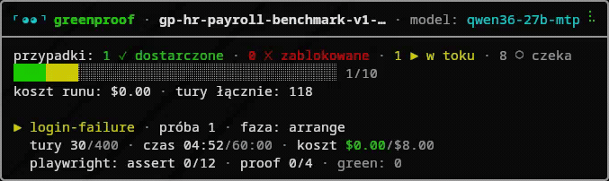

# greenproof

**Wersja: 0.1.67**



Agentowe autorowanie testów E2E Playwright: agent pisze testy, dowód
mutacyjny rozstrzyga o ich wartości, a pipeline sam akceptuje to, co
dowiedzione - człowiek klika `release` na końcu. Platform-agnostic: rdzeń nie
importuje niczego platformowego -
GitHub, filesystem i customowe platformy firmowe implementują te same
kontrakty.

> **Schematy architektury** - jak biblioteka wpina się w terminal, CI i GitHub
> Actions oraz jak działa silnik sesji (Agent SDK):
> **[ARCHITEKTURA.md](ARCHITEKTURA.md)**

1. [Wprowadzenie i szybki start](#1-wprowadzenie-i-szybki-start)
2. [Benchmarki i filozofia kosztowa](#2-benchmarki-i-filozofia-kosztowa)
3. [Pipeline i komendy](#3-pipeline-i-komendy)
4. [Użycie CLI](#4-użycie-cli)
5. [Użycie CI](#5-użycie-ci)
6. [Użycie GitHub Actions](#6-użycie-github-actions)
7. [Integracja z providerami i modelami](#7-integracja-z-providerami-i-modelami)
8. [Silnik sesji](#8-silnik-sesji)
9. [Skille](#9-skille)

## Instalacja

```sh
pnpm install
pnpm setup-cli      # udostępnia komendy gp i greenproof
gp --version
```

Po zmianach w `packages/*/src`: `pnpm build`. `greenproof` jest pełnym aliasem `gp`.

Biblioteka powstała na Linuksie (Fedora) i Linux to środowisko pierwszego
wyboru. Windows jest wspierany natywnie (cmd/PowerShell, bez WSL)
i weryfikowany jobem CI na `windows-latest` - **jeśli coś nie działa na
Windowsie, zgłoś to**.

Gdzie lądują wrappery: `~/.local/bin` na Linuksie i macOS (nadpiszesz przez
`XDG_BIN_HOME`), `%LOCALAPPDATA%\greenproof\bin` na Windowsie - tam jako pliki
`.cmd`, które zwracają kod wyjścia CLI (3/5/10 sterują przepływem CI). PATH-u
skrypt nie rusza sam: gdy katalog docelowy nie jest w PATH, wypisuje gotową
linijkę do dopisania.

### Windows: w PowerShellu nie wołaj `gp`

`gp` to **wbudowany alias `Get-ItemProperty`**, a aliasy mają w PowerShellu
pierwszeństwo przed komendami z PATH. `gp --version` nie uruchomi więc CLI,
tylko cmdlet - z mylącym komunikatem w rodzaju
`Cannot find path 'C:\...\--version' because it does not exist.`. W PowerShellu
używaj pełnej nazwy albo wrappera z rozszerzeniem (rozszerzenie omija tablicę
aliasów):

```powershell
greenproof run --tests-repo C:\moje-testy   # zalecane
gp.cmd run --tests-repo C:\moje-testy       # równoważne
```

Jeśli chcesz odzyskać krótkie `gp`, zdejmij alias raz na stałe w swoim profilu
(`notepad $PROFILE`):

```powershell
Remove-Item Alias:gp -Force
```

W `cmd.exe` problemu nie ma - tam `gp` trafia w `gp.cmd` przez PATHEXT. Cała
dokumentacja i skille piszą `gp ...` w formie uniwersalnej; na Windowsie w
PowerShellu czytaj to jako `greenproof ...`.

## 1. Wprowadzenie i szybki start

greenproof zamienia plan testów E2E w realne specy Playwright: agent-autor
odkrywa aplikację, pisze testy i **dowodzi mutacyjnie**, że asercja faktycznie
łapie warunek - zielony przebieg bez ważnego dowodu jest bezwartościowy.
Pipeline sam akceptuje to, co dowiedzione (dowód `valid` bez ostrzeżeń
walidatora + czysty lint anty-duplikacji selektorów); człowiek klika `release` i zajmuje się case'ami,
których dowód nie rozstrzygnął.

### Zacznij tutaj: konfiguracja z asystentem AI

Najprostsza droga do pierwszego przebiegu. Asystent AI prowadzi wywiad
onboardingowy (repo testów, aplikacja, platforma, provider, model, token,
plan testów), generuje config, uruchamia preflight i podaje gotową komendę
`gp run` - ty tylko odpowiadasz na pytania i zatwierdzasz. Jak zacząć:

- **Claude Code** - wpisz `/greenproof-start`.
- **Inny asystent** - poproś po prostu o skonfigurowanie greenproof.

Przewodnik skilla: [`skills/greenproof-start.md`](skills/greenproof-start.md).

### Chcesz najpierw zobaczyć, jak to działa (bez własnego repo)?

```sh
pnpm demo                    # sonnet 5 przez bramę LiteLLM
pnpm demo --model deepseek   # deepseek flash przez bramę LiteLLM
```

`pnpm demo` stawia trudną appkę demo, przygotowuje świeże repo testów, generuje
config i odpala pełny przebieg z żywą tablicą postępu; na końcu wypisuje wynik
(✓/✗, koszt, tury) i komendy `accept`/`release`. `--dry-run` zatrzymuje się po
preflighcie (bez sesji modeli). Appka demo jest w repo (`examples/apps/hr-payroll`),
więc demo działa bez stawiania czegokolwiek z zewnątrz.

### Ręczna konfiguracja własnego repo testów

Wolisz ustawić wszystko sam - tu są presety, configi i wymagania:

- **Szybki start: `run --init-only` + `run`** - presety providerów, przykłady komend i
  krok po kroku: **[docs/configuration.md](docs/configuration.md)**
- **Gotowe configi startowe** - `litellm.config.mjs` (brama LiteLLM),
  `codex.config.mjs` (subskrypcja przez mostek OAuth), `claude.config.mjs`
  (Anthropic/Claude wprost): **[docs/configuration.md](docs/configuration.md)**
- **Wymagania środowiska** - co runner musi mieć zainstalowane:
  **[docs/runner-requirements.md](docs/runner-requirements.md)**

## 2. Benchmarki i filozofia kosztowa

Pełna pętla `filter → triage → author → dowód mutacyjny → deliver → accept →
release` na dwóch appkach demo. Koszty w tabelach to zawsze estymaty (tokeny ×
cennik), oznaczone `(est.)`; przy abonamencie/subskrypcji realny wydatek
z kieszeni to zero.

### Filozofia kosztowa

Koszt jest jedynym twardym ograniczeniem; pipeline egzekuje go na kilku
poziomach (szczegóły capów: [docs/config-reference.md](docs/config-reference.md),
sekcja `caps`):

- **Capy per case** - tury / koszt / czas / runy playwright; hooki przerywają
  sesję po przekroczeniu.
- **Higiena snapshotów** - pełny `browser_snapshot` tylko po realnej zmianie
  strony; bramka `snapshotGating` (`warn` → `enforce`) plus przycięcie
  `snapshotMaxChars`.
- **Harvest POM** - autor dostaje dopasowane POM-y/fixture'y z indeksu; duplikat
  selektora oznaczany w `deliver`.
- **Bezpiecznik seedu** - po `maxFailedStrategies` churn-prone case kończy się
  `BLOCKED` + `fixture-gap` zamiast mielenia do capu.
- **Oracle** - wartości oczekiwane WYŁĄCZNIE z golden-case'ów, nigdy z UI.
- **Własny licznik kosztu (`priceTable`)** - `total_cost_usd` z SDK bywa błędny
  dla customowych nazw modeli za bramą.

### Easy app (DemoPay)

2 case'y golden path (`E2E-LOGIN-001` P0, `E2E-PAYROLL-002` P1 - churn-prone
`lista-plac`). Skondensowane wyniki; pełne tabele i identyfikatory modeli:
[docs/benchmarks-easy-app.md](docs/benchmarks-easy-app.md).

#### Chmura i abonamenty

| Model | LOGIN | PAYROLL | Koszt autora | Koszt eskalacji |
|---|---|---|---|---|
| deepseek-v4-flash 0731 | ✅ released | ✅ released (3. próba) | ~$0,12 | $1,30 (est.) - 1 run ratunkowy |
| gemini-3.7-flash | ✅ released | ✅ released | $0,19 | $0,47 (est.) - run prewencyjny |
| GLM 5.2 | ✅ released | ✅ released (2. próba) | $0,36 | kilka centów (est.) - run prewencyjny |
| claude-opus-5 | ✅ released | ✅ released | $3,33 (est.) | $0,70 (est.) - run prewencyjny |
| gpt-5.6-luna | ✅ released | ✅ released | ~$3,36 (est.) | $2,00 (est.) - prewencyjny + 1 ratunkowy |
| claude-sonnet-5 | ✅ released | ✅ released | $4,39 (est.) | run prewencyjny, kwoty brak w źródle |

#### Modele lokalne

| Model | LOGIN | PAYROLL | Koszt autora | Koszt eskalacji |
|---|---|---|---|---|
| Laguna-XS-2.1 33B-A3B | ✅ released | ✅ released | $0 (czas GPU) | $0,19 - run prewencyjny |
| Qwen3.6-27B-MTP | ✅ released | ✅ released | $0 (czas GPU) | $0,27 - run prewencyjny |
| Muse-Glimmer-30B | ✅ released | ✅ released | $0 (czas GPU) | $0,34 - run prewencyjny |
| Qwen3.8-27B | ✅ released | ✅ released | $0 (czas GPU) | $0,47 - run prewencyjny |
| Ornith-1.0-35B | ✅ released (2. próba) | ✅ released (2. próba) | $0 (czas GPU) | $0,78 - prewencyjny + 1 ratunkowy |
| Qwen3.6-35B-A3B | ✅ released | 🚧 blocked (fixture-gap ×2)¹ | $0 (czas GPU) | $1,31 - prewencyjny + 2 ratunkowe |

¹ A3B: jedyny lokalny z wyłączonym myśleniem - dowód mutacyjny ok, ale model
nie doprowadził appki do stanu wyjściowego (`fixture-gap`).

Koszt autora i koszt eskalacji stoją osobno, bo to nieporównywalne rzeczy:
eskalację prowadzi INNY, mocniejszy model i potrafi kosztować kilkanaście razy
więcej niż sam autor. `(est.)` oznacza wycenę wg cennika sesji, za którą realnie
nie wyszedł ani grosz (abonament, subskrypcja) - liczby bez tego dopisku to
pieniądze faktycznie zapłacone. Im więcej runów ratunkowych, tym mocniej model
potrzebował pomocy.

- **Run prewencyjny** - wąska sesja fixture odpalona PRZED partią, raz na
  churn-prone typ case'ów (plan zna te typy z góry). Mocniejszy model dorabia
  seed jeden raz, zamiast żeby każdy case rozbijał się o niego osobno.
- **Run ratunkowy** - sesja fixture odpalona PO tym, jak bezpiecznik seedu
  zatrzymał case'a (`blocked(fixture-gap)`). Mocniejszy model dostarcza
  brakujący fixture, a case dostaje dodatkową próbę poza pulą auto-retry.

### Complex app (HR-Payroll)

10 case'ów (role, paginacja serwerowa, optimistic locking, PESEL z cyfrą
kontrolną, workflow statusów, nakładanie urlopów, celowy churn payrollu).
Pełne tabele + macierz per case: [docs/benchmarks-complex-app.md](docs/benchmarks-complex-app.md).

| Model | Wynik | Σ tur | Czas | Koszt autora | Eskalacje |
|---|---|---|---|---|---|
| deepseek-flash-max + opus | ✅ **10/10** | 1734 | 141 min | $1,76 (est.) | 2 ratunkowe (opus): $1,37 + $1,06 (est.) |
| gemini-3.7-flash | ✅ **10/10** | 616 | 45 min | $2,30 | brak |
| gpt-5.6-luna(max) + sol(high) | ✅ **10/10** | 1879 | 129 min + retry | $25,60 (est. SDK, prawdopodobnie zawyżona) | 2 ratunkowe (sol): jedna nieudana, jedna $1,04 (est.) |
| Qwen3.6-27B-MTP (**lokalny**) | ✅ **10/10** (8/10 w runie, 2 case'y po ręcznym retry) | 1408 + 330 w retry | 337 min + 91 min retry | **$0** (czas GPU) | brak |

Kolumna „Koszt autora" jest porównywalna wprost z tą samą kolumną w tabelach
easy app. Eskalacje na tej appce wywoływał wyłącznie churn payrollu: dwa case'y
(`payroll-create-churn`, `payroll-approve-pay`) rozbijały się o seed i to one
uruchamiały runy ratunkowe.

Model **lokalny** dochodzi do tego samego 10/10 co modele chmurowe, tylko
wolniej i z jedną ręczną interwencją: w runie dwa case'y padły na 60-minutowym
capie, a po retry z podniesionym czasem oba dowiozły ważny dowód. Wszystkie 10
dowodów mutacyjnych przeszło walidator bez jednego ostrzeżenia - lokalny 27B nie
produkuje „zieleni na skróty", tylko potrzebuje na nią więcej czasu GPU.

**Wzorzec:** mocny model płaci za odkrycie raz (run prewencyjny $0,19-0,86,
ratunkowy $1,14-1,30), tani autor dowozi resztę - a dowód mutacyjny odsiewa
fałszywą zieleń niezależnie od modelu.
Pełna historia runów, metodyka i monitoring: [docs/benchmarks.md](docs/benchmarks.md).

## 3. Pipeline i komendy

```
filter → triage → author → [dowód mutacyjny] → deliver → auto-accept (pipeline) → release (człowiek, bramki)
```

Każdy krok ma osobny JSON wejścia/wyjścia (schematy w
`packages/core/src/schemas/io.ts`) i daje się odpalić samodzielnie przez
`gp step <krok>` - job CI wywołuje je sekwencyjnie, a kody wyjścia sterują
przepływem (tabela: [docs/configuration.md](docs/configuration.md), sekcja
„Kody wyjścia"). `gp run` robi to samo w jednym procesie.

- **filter** - wybiera case'y E2E z planu, odsiewa już pokryte, liczy dynamiczny
  `timeoutMinutes` partii, melduje roster. Deterministyczny, idempotentny.
- **triage** - składa kontekst startowy per case: przypadek + dopasowane
  POM-y/fixture'y z inwentarza + wiedza projektowa (`ui-traps.yaml`,
  `app-map.yaml`) + digest poprzedniej próby. Idempotentny.
- **author** - odpala świeże sesje agenta-autora (Claude Agent SDK) per case;
  egzekuje capy: tury, koszt, czas, runy `playwright test` w fazie assert.
- **dowód mutacyjny** (wbudowany w sesję, walidowany deterministycznie po niej)
  - po dwóch zielonych przebiegach agent celowo psuje warunek i musi zobaczyć
  czerwony własną asercją (nie timeout, nie błąd infrastruktury), a `git diff`
  po przywróceniu ma być pusty.
- **deliver** - melduje drafty (z lintem anty-duplikacji selektorów), case'y
  `BLOCKED` z notatką fixture-gap, propozycje wiedzy oraz - dla
  `blocked(other)` z notatką agenta - osobny raport `app_defect_suspected`
  (deklaracja „aplikacja/kontrakt API blokuje flow", do werdyktu człowieka).
  Raport rozróżnia „kwalifikuje się do auto-akceptacji" od „czeka na Ciebie".
- **auto-accept** (wbudowany w `run`, po deliver) - deterministyczna bramka:
  case spełniający TWARDE kryterium (dowód mutacyjny `valid`, ZERO ostrzeżeń
  walidatora, czysty lint anty-duplikacji selektorów) jest akceptowany sam,
  bez pytania modelu o zdanie. Ostrzeżenie walidatora oznacza dowód ważny
  mechanicznie, ale słabszy - taki case zostaje człowiekowi, bo akceptacja
  jest jedynym momentem, w którym ktoś to ostrzeżenie przeczyta. Wyłączalne
  flagą `--no-auto-accept` albo `gates.autoAccept: false` w configu.
- **accept** - ręczne narzędzie dla case'ów, których pipeline nie przyjął:
  PR z brancha case'a do gałęzi docelowej. Agent NIE ma prawa pushować
  (deny hook).
- **release** - bramki jakości: P0 blokuje bezwzględnie, P1 wymaga waiveru,
  P2/P3 informacyjne; domknięcie uczenia listy churn-prone.

### Komendy

Każda komenda: `gp <komenda> --config <ścieżka> [--run <runId>] [--in <in.json>] [--out <out.json>]`.
Stdout = wyłącznie JSON wyniku, stderr = logi. Kolumna „Wejście" nazywa schemat
z `packages/core/src/schemas/io.ts`; `-` = komenda nie czyta `--in`.

#### Codzienne

| Komenda | Wejście | Co robi |
|---|---|---|
| `run --init-only` | `--tests-repo` | Generuje config z presetu providera; sekretów nie zapisuje |
| `run` | `FilterInput` albo plan | Cała orkiestracja: preflight → filter → triage → fixture → author → deliver → auto-accept |
| `step <krok>` | schema kroku | Jeden krok pipeline'u jako osobny job CI (kroki opisane wyżej) |
| `retry` | `RetryInput` | Pętla retry → triage → author → deliver dla jednego case'a |
| `accept` | `AcceptInput` | PR z brancha case'a do gałęzi docelowej - jedyny push do repo testów |
| `release` | `ReleaseInput` | Bramki jakości i domknięcie przebiegu |
| `status` | `StatusInput` | Stan przebiegu, tylko odczyt; `--cases` dokłada rollup per case z ledgerów |
| `models` | - | Lista modeli z endpointu autora (`GET /v1/models`) |

#### Okazjonalne

| Komenda | Wejście | Co robi |
|---|---|---|
| `fixture` | `FixtureInput` | Sesja fixture-authora: tryb `case` po `blocked(fixture-gap)`, tryb `preventive` przed partią (per churn-prone typ) |
| `preflight` | - | Waliduje endpoint modelu: ping `/v1/messages` + wymuszony tool-call (mostki gubią `tool_use`) |
| `clean` | `CleanInput` | Kasuje artefakty i branche case'ów po `released`; `purge` sięga też ledgera, specu i dowodu |
| `knowledge init` / `lint` | - (podkomenda) | Szablony wiedzy (`ui-traps.yaml`, `app-map.yaml`) albo ich walidacja z wykrywaniem duplikatów |

Config `run` bierze z gotowego pliku (`--config`) albo generuje go razem ze
scaffoldem repo testów (`--tests-repo` + flagi presetu). Pełne flagi, presety
i zmienne środowiskowe: [docs/configuration.md](docs/configuration.md).

### Struktura repozytorium

Monorepo: `packages/core` (rdzeń bez zależności od platformy) + adaptery
(`adapter-fs`, `adapter-github`) + `packages/cli`. Pełne drzewo katalogów:
[docs/structure.md](docs/structure.md).

## 4. Użycie CLI

Presety providerów, flagi, wejście komend i zmienne środowiskowe:
[docs/configuration.md](docs/configuration.md). Pole po polu, co znaczy każde
ustawienie w configu: [docs/config-reference.md](docs/config-reference.md).

- `gp run --tests-repo <p> --init-only [--preset codex-sub|litellm|claude-sub]` -
  generuje config; każde pole modelu nadpiszesz flagą (`--author`,
  `--base-url`, `--token-env`, `--fixture-author <model>|none`).
- `gp run` - preflight → filter → triage → fixture → author → deliver →
  auto-accept w jednym procesie; `release` to osobna, świadoma decyzja
  człowieka (auto-akceptację wyłączysz flagą `--no-auto-accept` albo
  `gates.autoAccept: false`).
- Formaty configu: `.json`, `.yaml`, `.yml`, `.mjs`, `.js`, `.cjs` (export
  default); `.ts` nie obsługiwane.
- Stdout = wyłącznie JSON wyniku; stderr = logi + postęp
  (`GREENPROOF_PROGRESS`).

### Tablica statusu - co znaczy która etykieta

Tablica z nagrania na górze (renderer `tty`), wiersz po wierszu:

| Etykieta | Znaczenie |
|---|---|
| `przypadki: ✓ dostarczone` | case'y z ważnym dowodem mutacyjnym, gotowe do akceptacji |
| `✗ zablokowane` | case'y zatrzymane: brak fixture'a, wyczerpany cap albo podejrzenie defektu aplikacji |
| `▶ w toku` / `○ czeka` | sesja pracująca teraz / case'y jeszcze nietknięte |
| pasek + `3/10` | te same liczniki graficznie: zielone dostarczone, czerwone zablokowane, żółty case bieżący |
| `koszt runu` / `tury łącznie` | narastająco dla całego przebiegu (1 tura = 1 wiadomość agenta) |
| `próba 2` | numer podejścia do tego case'a; kolejne dostaje digest poprzedniego |
| `faza: arrange` | co agent robi teraz: **arrange** doprowadza aplikację do stanu wyjściowego, **act** wykonuje scenariusz, **assert** pisze i zieleni asercje, **proof** prowadzi dowód mutacyjny |
| `tury 66/400 · czas · koszt` | zużycie tego case'a vs jego capy; przekroczenie któregokolwiek kończy sesję |
| `playwright: assert 3/12` | ile uruchomień `playwright test` zjadła faza assert z puli `caps.maxPlaywrightRuns` |
| `proof 0/4` | **osobna** pula na dowód mutacyjny (`caps.proofRuns`), odblokowywana po drugim zielonym przebiegu - dzięki niej dowodu nie da się zagłodzić dochodzeniem do zieleni |
| `green: 2` | ile razy testy przeszły na zielono; dowód wymaga dwóch, zanim agent zacznie psuć warunek |
| `ostatnio` | ostatnie zdarzenie sesji, zwykle wynik ostatniego uruchomienia testów |

Awatar w nagłówku pokazuje tę samą fazę mimiką, a spinner obok kręci się
niezależnie od zdarzeń - stoi tylko wtedy, gdy proces naprawdę stanął.

## 5. Użycie CI

Na serwerze CI kroki pipeline'u odpalasz jako osobne zadania (`gp step filter`,
`gp step triage`, `gp step author`, `gp step deliver`) - każde czyta JSON
poprzedniego, a kod wyjścia mówi zadaniu, co dalej. Rozbicie na osobne zadania
ma jeden konkretny powód: `filter` liczy dynamiczny `timeoutMinutes` partii,
który musi trafić do limitu czasu zadania autora, zanim ono wystartuje.

Czego taka maszyna potrzebuje (Node ≥ 20, pnpm, chromium dla Playwright,
sekrety modelu i platformy) i jak liczyć limity czasu:
[docs/runner-requirements.md](docs/runner-requirements.md).

Pisanie własnego adaptera platformy (porty, retencja, branche, checklista
testów): [docs/adapters.md](docs/adapters.md).

## 6. Użycie GitHub Actions

Wzorzec jobów i Job Summary: [docs/github-actions.md](docs/github-actions.md).
Referencyjne workflow w `examples/github-workflow/`:

- `e2e-start.yml` - trigger `/e2e-start` w komentarzu issue; `filter`
  i `author` to osobne joby, żeby dynamiczny `timeoutMinutes` partii trafił do
  `timeout-minutes` joba autora.
- `e2e-decision.yml` - trigger `/e2e-retry`, `/e2e-accept`, `/e2e-release`.

CLI sam wykrywa Actions (`GITHUB_ACTIONS=true`) i przełącza renderer na
`github` - linie `[gp HH:MM:SS]`, zwijane grupy `::group::` per case i tabela
per case w Job Summary.

## 7. Integracja z providerami i modelami

Silnik autora wymaga dowolnego endpointu w formacie Anthropic (`/v1/messages`).
Modele z subskrypcji wchodzą przez lokalne mostki OAuth →
endpoint, np. **CLIProxyAPI**. Przed pierwszym runem obowiązkowy
`gp preflight`. Pełny opis: [docs/model-bridges.md](docs/model-bridges.md).

- **CLIProxyAPI** - modele z subskrypcji przez `http://127.0.0.1:<port>/v1/messages`.
- **LiteLLM** - budżety kluczy wirtualnych, telemetria, fallbacki; model z bramy
  + eskalacja np. `claude-sonnet-5`.
- **Anthropic wprost** - bez `baseUrl`, token z subskrypcji CLI.

## 8. Silnik sesji

Silnikiem sesji jest **Claude Agent SDK**, a modele spoza Anthropica wchodzą
przez mostki mówiące formatem Anthropic. Wybór świadomy: cała dyscyplina
dowodowa żyje w hookach wewnątrz pętli (PreToolUse, AbortController w naszym
procesie), a SDK działa w procesie biblioteki - typowany stream, własny licznik
kosztu z `priceTable`, transcript jsonl pod kontrolą. Furtka jest wbudowana:
`sessionRunner` w author i fixture-author jest wstrzykiwalny
(`AuthorSessionOptions → AuthorSessionResult`).

## 9. Skille

Przewodniki operacyjne dla agentów (po polsku, „jeśli X → zrób Y"). Kanoniczna
treść w `skills/*.md`, wskaźniki Claude Code w `.claude/skills/`.

| Kiedy użyć | Skill |
|---|---|
| Odpalenie/powtórka/debug przebiegu (`gp run`, flagi, `.env`, kody wyjścia, `status`/`accept`/`release`/`clean`) | [`skills/greenproof-cli.md`](skills/greenproof-cli.md) |
| Interpretacja wyniku runu, retry vs eskalacja fixture, rekomendacja accept/waiver/release, sprzątanie i monitoring | [`skills/greenproof-operator.md`](skills/greenproof-operator.md) |
| Zmiana modelu/providera, presety, `priceTable`, capy, efforty, tokeny, preflight | [`skills/greenproof-config.md`](skills/greenproof-config.md) |

Zasady nadrzędne: `release` i `clean --purge` to decyzje CZŁOWIEKA - agent
przygotowuje komendę, nie uruchamia jej bez zgody. Auto-akceptację w `run`
robi pipeline sam (deterministycznie, po dowodzie) - to nie jest decyzja
agenta; ręczna komenda `accept` (dla case'ów, których pipeline nie przyjął)
nadal wymaga zgody człowieka. Agent nie pushuje do repo testów (jedyny push
to PR akceptacji); appka testowana musi działać przed runem.
